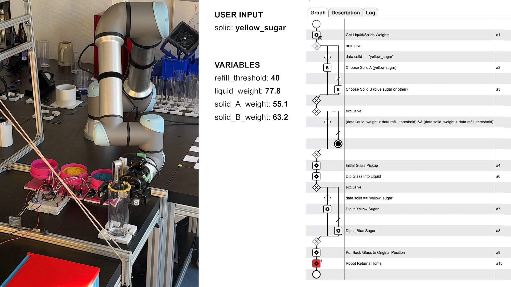
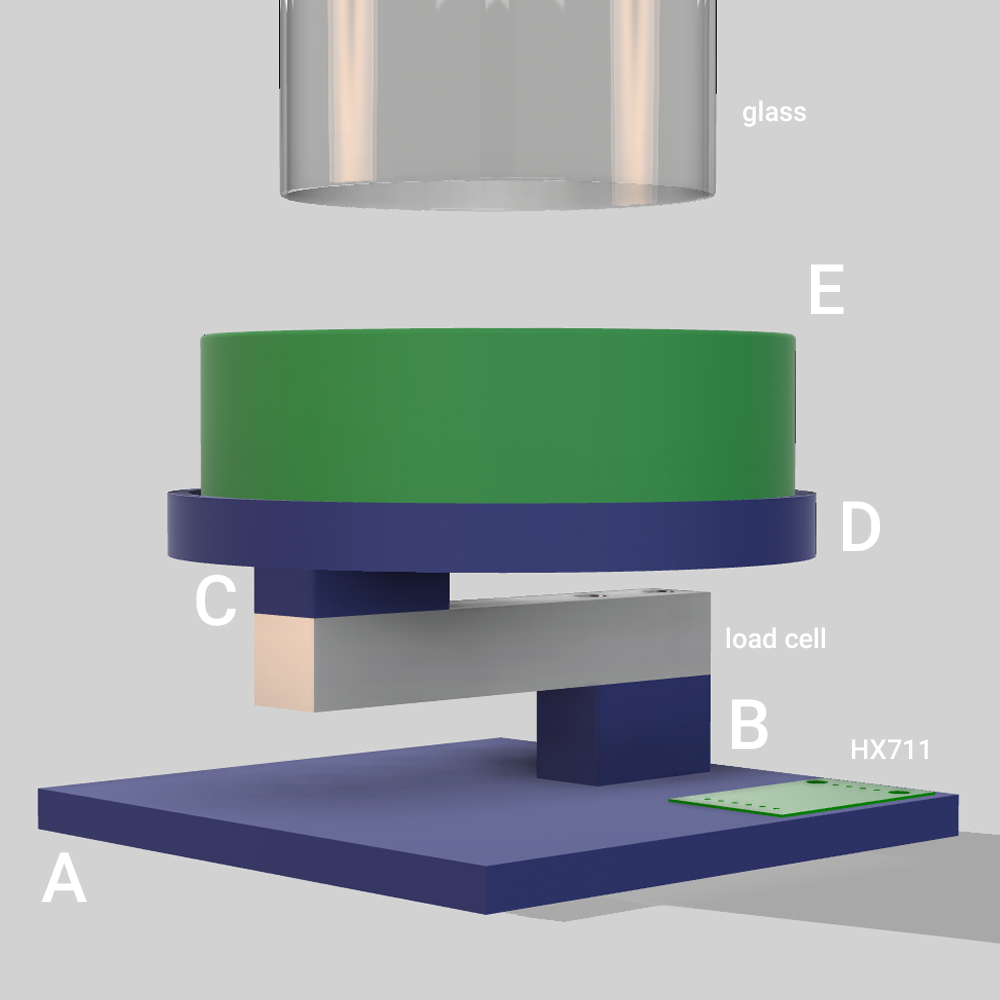
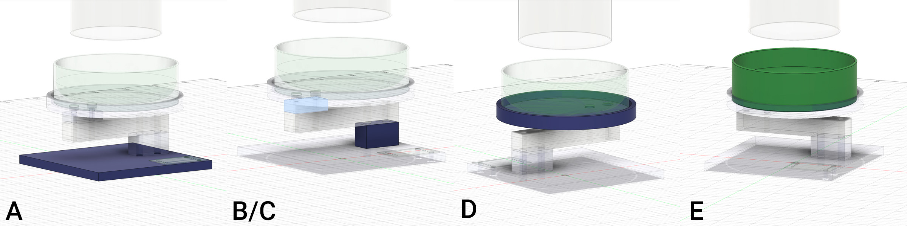

# Automated Cocktail Rimming System

**Practical Course SS24**

An automated solution to streamline the process of rimming cocktail glasses, enhancing efficiency, consistency, and reducing resource waste, while at the same time praciting different skills like process management, 3D printing, electronics and process design/execution.

## Video

[](https://youtu.be/M-wNSkutfYI){:target="_blank"}  
*Click on the preview image to play the video on YouTube*

## Project Overview

### Main Idea

The goal of this project is to automate the process of rimming a cocktail glass. This involves dipping the glass first into a liquid (often lemon juice or syrups) and subsequently into a coating (such as sugar or salt) to enhance the presentation and flavor of the cocktail.

The project aims to solve the problem of manually rimming cocktail glasses by ensuring a consistent and efficient application of the sugar or salt coating. In practical use, this automation improves cocktail preparation times and minimizes waste by precisely controlling the amount of applied liquid and solid. Additionally, it provides the ability to track quantities used via integrated weighing sensors.

## Technical Summary

The project consists of three main components:

- **Robot**: From [Universal Robots](https://www.universal-robots.com/) for ultra precise and repeatable movements.
- **Hardware**: Custom-designed, 3D-printed components. *[(Go to section)](#hardware)*
- **Software**: Composed of CPEE, ESP32 code, and a custom web server. *[(Go to section)](#software)*

  
*High-level overview of the cocktail rimming process in BPMN.*

## Hardware

The hardware includes three identical stations to store and weigh the substances (one for the liquid and two for the solids). These stations connect to a central unit containing all circuits, the ESP32 microcontroller, an ON/OFF switch, and an OLED display.

This modular design facilitates straightforward scalability in the future.

### Components

- **In each station (3 total):**
  - **3D Printed Parts:**
    - Square base plate ([A](assets/3d_parts/A.stl))
    - Supports for the load cell ([B](assets/3d_parts/B.stl), [C](assets/3d_parts/B.stl))
    - Circular base plate (as a base for the plate) ([D](assets/3d_parts/D.stl))
    - Main plate (for storing liquid/solids) ([E](assets/3d_parts/E.stl))
  - **Electronics:**
    - 5kg load cell
    - HX711 amplifier
- **Control Center:**
  - ESP32 microcontroller (with WiFi support)
  - OLED I2C display
  - ON/OFF switch (connected to a 5V power adapter)

  
*Hardware overview*

The custom 3D parts were designed using [Autodesk Fusion 360](https://www.autodesk.com/products/fusion-360/overview). Links to the `.stl` files for each component can be found above in the parts list.

  
  
*3D-printed hardware components.*

The design went through several iterations to find optimal solutions for various aspects such as load cell sensitivity, vibration motors to distribute sugar/salt (eventually discarded), and different plate sizes.

  
*Multiple design iterations were necessary to achieve a working solution.*

Below is a diagram representation of the ESP32 pins and their connections.

  
*Wiring diagram for the electronics connected to the ESP32.*

## Software

### Architecture

  
*Architecture of all project components and their interactions.*

The software architecture includes the following main services:

- [**ESP32**](#esp-32): REST services between hardware and CPEE, web server, load cell configuration, and display management.
- [**CPEE**](#cpee): Process engine and orchestrator.
- **Robot**: Manages robotic actions to execute glass dipping sequences.
- [**WiFi Router**](#wifi-router): Makes the ESP32 web server accessible publicly.

#### ESP32

- **Purpose**: Provide a simple REST service to control and monitor the load cells (weight retrieval, status, calibration) and control the display (showing IP addresses for connecting to the web server).

The ESP32 uses an asynchronous web server (`AsyncWebServer`) to expose the routes. The endpoints are designed to guarantee isolation of data from the process, enabling them to be reused in various contexts with minimal dependencies.

##### API Documentation: GET `/weight`

- **Endpoint:**
  - **URL:** `{{WEBSERVER_IP}}/weight`
  - **Method:** `GET`
  - **Description:** Retrieves weight measurements (in grams) from all load cells connected to the ESP32 device.

##### **Response:**

- **Status Code:** `200 OK`
- **Content-Type:** `application/json`
- **Response Body:**
  
  ```json
  {
      "load_cells": [
          {
              "id": 1,
              "weight": 1.8
          },
          {
              "id": 2,
              "weight": 0.1
          },
          {
              "id": 3,
              "weight": 0.7
          }
      ]
  }
  ```

##### **Notes:**

- Replace `{{WEBSERVER_IP}}` with the IP address or domain name of the ESP32 web server.
- Weights are returned in grams with up to one decimal precision.

Additional routes are designed in `src/routes.cpp`. A Postman collection of all endpoints is available in [`assets/postman_collection.json`](assets/postman_collection.json).

Utilities for tasks such as load cell calibration, display testing, and HX711 debugging are available in the `utils` folder.

The project is built and managed via [PlatformIO](https://platformio.org/).

#### CPEE

- **Purpose**: Create a modular and well-structured process that coordinates the interactions between the user, sensors (load cells), and the robot.

Refer to the [video](#video) for a graphical representation of the process. Multiple CPEE components, such as service calls, script elements, and decisions, were used to fully utilize CPEE's capabilities.

#### WiFi Router

- **Purpose**: Expose the ESP32 web server endpoints to the internet.

Since modifying the routing configuration on eduroam is not possible, an additional router is used. The ESP32 connects to this router, which assigns a static local IP (192.168.0.125). Port forwarding is then set up to make port 80 accessible online, redirecting it to the ESP32's services.

The script [`utils/server_api.php`](utils/server_api.php) is used on the public server to forward requests to the ESP32.

## How to Run

- **ESP32 Setup:**
  - Create a file `data/wifi_credentials.txt` following the format in `data/SAMPLE_wifi_credentials.txt`.
  - In `main.cpp`, adjust:
    - Local IP address of the ESP32.
    - Public IP address or URL for accessing the web server.

- **Local Router Setup:**
  - Set up port forwarding for the ESP32's local IP address.

- **Public Server Setup:**
  - Upload `utils/server_api.php`.
  - Update the IP and port for the router.

## Challenges

### Personal Challenges

- Learning new skills including 3D modeling, 3D printing, soldering, electronics, and integrating these skills with robot commands.
- Optimizing the process engine based on lessons learned from the BPTM course.

### Technical Challenges

- Managing liquid and sugar refill (when below the threshold) using the robot.
- Ensuring even distribution of sugar/salt to avoid forming clumps (initially considered using a vibration motor).

## Future Implementations

- Use smaller load cells (e.g., less than 5kg) to better suit this application.
- Build an enclosure for the main unit.
- Add support for additional liquids/solids for a more modular design.
- Add debug/status displays for better monitoring.

---
**Author:** Emanuele Salonico | [emanuele.salonico@tum.de](mailto:emanuele.salonico@tum.de)
